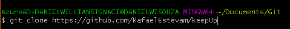

# Keep UP   

Criar uma aplicação para Gerenciamento de visitas e store no ramo imobiliario.

## Pré-requisitos:
- Ter instalado uma IDLE.
- Ter o sistema de controlr de versão GIT instalado: ->https://git-scm.com/

## Como executar o Projeto:
1. Fazer clone do repositôrio disponivel em: ->
https://github.com/RafaelEstevam/keepUp.

2. Abrir a o seguinte caminho:

